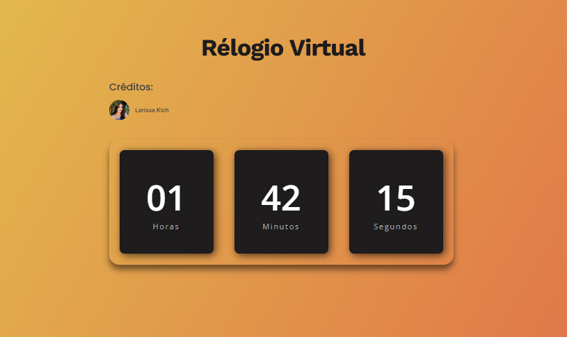

<h1 align="center"> Relogio Virtual </h1>

  <a href="#-tecnologias">Tecnologias</a>&nbsp;&nbsp;&nbsp;|&nbsp;&nbsp;&nbsp;
  <a href="#-projeto">Projeto</a>&nbsp;&nbsp;&nbsp;|&nbsp;&nbsp;&nbsp;
  <a href="#-layout">Layout</a>&nbsp;&nbsp;&nbsp;

 

  

## 🚀 Tecnologias

Esse projeto foi desenvolvido com as seguintes tecnologias:

- HTML e CSS
- JavaScript
- Git e Github

## 💻 Projeto

O Relógio Virtual é um projeto desenvolvido para mostrar as horas exatas para seus usuários.

- [Visite o projeto online](https://daya-diaz.github.io/virtual-clock)

## 🔖 Layout

Você pode visualizar o vídeo do projeto através [DESSE LINK](https://www.youtube.com/watch?v=GK0ok3ZCXwM).

---

Feito com ♥ by Daya :wave: